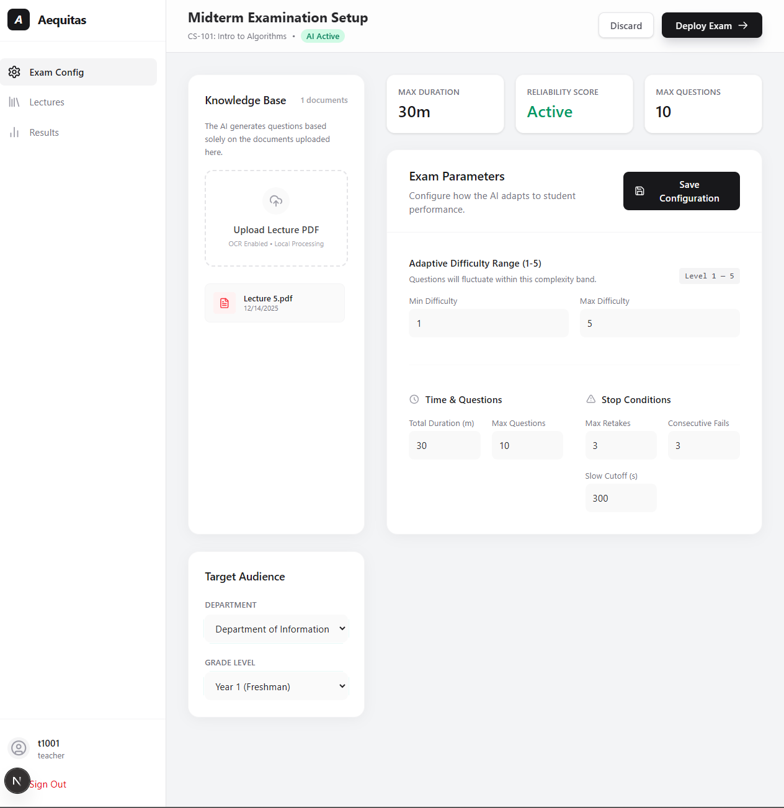
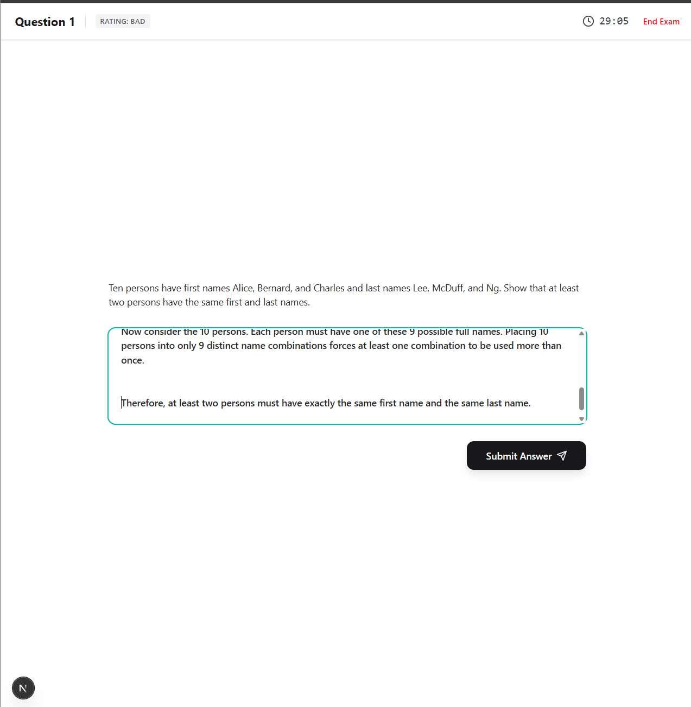
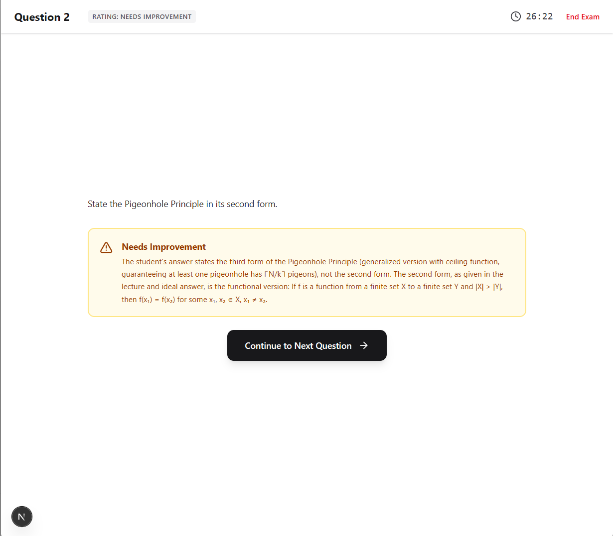
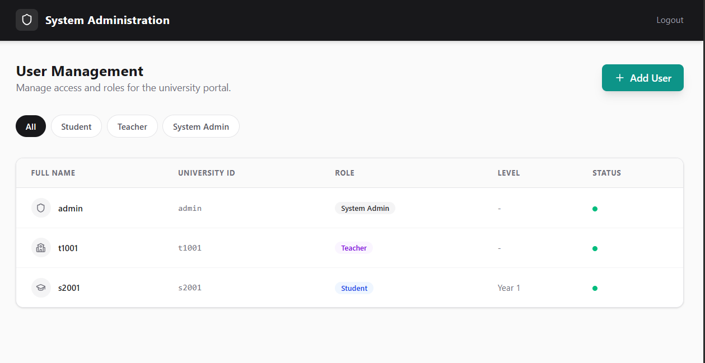

# AI-Powered Adaptive Examination System

An experimental Local-first **adaptive exam** system for universities, powered by retrieval (RAG) + an **OpenAI-compatible** LLM endpoint. Please note that this project is intended as a proof-of-concept and needs additional work to get it to the MVP stage :)

- **No registration UI**: users are pre-created in the SQLite DB (demo seed script included).
- **Teacher workflow**: upload lectures (PDF / images via optional OCR), configure exam settings per department + grade.
- **Student workflow**: timed adaptive exam, AI-generated questions + AI grading + server-enforced stop rules.
- **Storage**: SQLite for relational data *and* a lightweight vector index stored in SQLite (no separate vector DB).

## Screenshots

<p align="center">
  
</p>
<p align="center">
  <em>Teacher dashboard: configure exams by department/grade and manage lecture context.</em>
</p>

<p align="center">
  
</p>
<p align="center">
  <em>Student exam flow: timed responses and adaptive continuation/end logic driven by the backend.</em>
</p>

<p align="center">
  
</p>
<p align="center">
  <em>AI grading feedback: correctness scoring + feedback returned by the LLM and persisted for review.</em>
</p>

<p align="center">
  
</p>
<p align="center">
  <em>Admin dashboard: manage core academic entities and users (for seeded/demo setups).</em>
</p>

## Project structure (high level)

- **Backend (FastAPI)**: `app/` (session auth, routers, SQLite + embeddings)
- **Frontend (Next.js)**: `frontend/` (modern UI that proxies to the backend)
- **Data**: `data/` (SQLite DB + uploaded lecture files) — intentionally not committed

## Quickstart (Backend: FastAPI)

### Prerequisites

- Python 3.11+

### Install

```bash
python -m venv .venv
source .venv/bin/activate
pip install -r requirements.txt
```

### Configure environment

Copy the example env file:

```bash
cp .env.example .env
```

The backend reads env vars via Pydantic Settings (`app/config.py`). These are the key variables (matching `.env.example`):

- **App**: `APP_NAME`, `ENVIRONMENT`, `SECRET_KEY`, `HOST`, `PORT`
- **Database**: `DATABASE_URL` (default `sqlite:///./data/app.db`)
- **Storage**: `UPLOAD_DIR`
- **Lecture chunking**: `CHUNK_SIZE_CHARS`, `CHUNK_OVERLAP_CHARS`, `MAX_CONTEXT_CHARS`, `CONTEXT_CHUNKS`
- **LLM (OpenAI-compatible)**: `LLM_PROVIDER`, `LLM_BASE_URL`, `LLM_API_KEY`, `LLM_MODEL`, `LLM_TEMPERATURE`, `LLM_MAX_TOKENS`, `LLM_TIMEOUT_SECONDS`, `LLM_FALLBACK_TO_MOCK`
- **Embeddings**: `EMBEDDING_PROVIDER`, `EMBEDDING_MODEL_NAME`, `EMBEDDING_DEVICE`, `EMBEDDING_DIM`
- **Exam defaults**: `EXAM_DEFAULT_*`
- **Scoring**: `SCORE_WEIGHT_*`
- **Upload limits**: `MAX_UPLOAD_MB`

### Seed demo data (recommended first run)

```bash
python -m scripts.seed_demo
```

Demo accounts created:

- **Admin**: `admin` / `admin123`
- **Teacher**: `t1001` / `teacher123`
- **Student**: `s2001` / `student123`

### Run the backend

```bash
python -m uvicorn app.main:app --reload --host 0.0.0.0 --port 8000
```

Open `http://localhost:8000`.

## Frontend (Next.js) — modern UI

The Next.js frontend runs separately and proxies requests to the backend (see `frontend/next.config.ts` rewrites to `http://127.0.0.1:8000`).

### Run the frontend

In a separate terminal:

```bash
cd frontend
npm install
npm run dev
```

Open `http://localhost:3000`.

## Local LLM configuration

This project calls an **OpenAI-compatible Chat Completions** API.

- **Ollama** (example): set `LLM_BASE_URL="http://localhost:11434/v1"` and choose `LLM_MODEL` (e.g. `llama3.1`)
- **llama.cpp server** (example): set `LLM_BASE_URL="http://localhost:8080/v1"`

If you don’t have an LLM running, use:

```env
LLM_PROVIDER="mock"
```

or keep `LLM_FALLBACK_TO_MOCK="true"` to automatically fall back when calls fail.

## Embeddings + retrieval (vector index in SQLite)

Lecture retrieval uses **`sentence-transformers/all-MiniLM-L6-v2`** by default (`EMBEDDING_PROVIDER="sentence_transformers"`).

If you change `EMBEDDING_PROVIDER` / `EMBEDDING_MODEL_NAME` on an existing DB, rebuild embeddings:

```bash
python -m scripts.reindex_embeddings
```

## OCR (optional)

If you upload images, OCR uses `pytesseract`. You must install the `tesseract` binary.

Ubuntu/Debian:

```bash
sudo apt-get update && sudo apt-get install -y tesseract-ocr
```

## Docker (optional)

```bash
cp .env.example .env
docker compose up --build
```

Data persists in `./data` (SQLite DB + uploads).

## Deployment guide (beginner-friendly, recommended: Docker + OpenRouter)

This app can run **backend-only** (FastAPI server-rendered pages) or with the optional **Next.js frontend**. For the simplest deployment, start with **backend-only** in Docker.

### 1) What you need

- A Linux server (a small VPS is fine)
- A domain name (optional but recommended)
- An **OpenRouter** API key (recommended default LLM provider for quick setup)

### 2) Provision a server

On Ubuntu/Debian:

```bash
sudo apt-get update
sudo apt-get install -y git
```

Install Docker + Compose (Docker’s official packages are recommended; once installed, confirm):

```bash
docker --version
docker compose version
```

### 3) Clone the repo

```bash
git clone https://github.com/Aaryan-Kapoor/ai-exam-system
cd ai-exam-system
```

### 4) Create your production `.env` (use OpenRouter)

```bash
cp .env.example .env
```

Edit `.env` and set (minimum):

- **Session security**:
  - `SECRET_KEY`: set a strong random string (this signs session cookies)
- **LLM via OpenRouter** (OpenAI-compatible):
  - `LLM_PROVIDER="openai_compat"`
  - `LLM_BASE_URL="https://openrouter.ai/api/v1"`
  - `LLM_API_KEY="<your_openrouter_api_key>"`
  - `LLM_MODEL="<an_openrouter_model_id>"`

Notes:

- **OpenRouter model id** examples include values like `x-ai/grok-4.1-fast`, `anthropic/claude-sonnet-4.5`, etc. Use any model supported by your OpenRouter account.
- This backend uses an OpenAI-compatible client; it sends `Authorization: Bearer <LLM_API_KEY>`.

### 5) Start the app with Docker Compose

```bash
docker compose up --build -d
```

Then visit:

- If your server IP is `1.2.3.4`: `http://1.2.3.4:8000`

### 6) Initialize demo data (optional)

If you want demo accounts/data (recommended for first-time verification):

```bash
docker compose exec web python -m scripts.seed_demo
```

### 7) Put it behind HTTPS (recommended)

For a beginner-friendly approach, use a reverse proxy that handles TLS:

- **Option A (easy)**: Caddy + reverse proxy to `127.0.0.1:8000`
- **Option B (common)**: Nginx + Let’s Encrypt (Certbot)

If you do this, you’ll typically:

- Keep Docker exposing `8000` internally
- Terminate TLS at the proxy
- Forward requests to `http://127.0.0.1:8000`

### 8) Backups (important)

All persistent state is in `./data` (mounted into the container). Back up:

- `data/app.db` (SQLite DB)
- `data/uploads/` (uploaded lectures)

### 9) Updates

```bash
git pull
docker compose up --build -d
```

### Using a local LLM instead (still supported)

If you want to avoid OpenRouter later:

- **Ollama**:
  - Run Ollama on the same server
  - Set `LLM_BASE_URL="http://127.0.0.1:11434/v1"`
  - Set `LLM_API_KEY="ollama"` (or blank)
  - Set `LLM_MODEL="llama3.1"` (or your chosen model)
- **llama.cpp server**:
  - Set `LLM_BASE_URL="http://127.0.0.1:8080/v1"`

If you want *zero* external dependencies:

```env
LLM_PROVIDER="mock"
LLM_FALLBACK_TO_MOCK="true"
```

### Deploying the Next.js frontend

The frontend currently proxies to `http://127.0.0.1:8000` via rewrites (`frontend/next.config.ts`), which is perfect for local dev.

For production you have two typical paths:

- **Same server**: run Next.js on the same VPS and update rewrites to point to your internal backend URL.
- **Separate hosting (e.g. Vercel)**: adjust the frontend to target your public backend domain (recommended change: make the API base configurable via an environment variable).


## Where to look in the code

- `app/main.py`: FastAPI app, session middleware, router registration, startup table creation
- `app/routers/auth.py`: login/logout and role-based redirects
- `app/routers/teacher.py`: teacher dashboard, exam configuration, lecture upload + indexing
- `app/routers/student.py`: student state, start/resume exam, answer flow, end exam, results
- `app/models.py`: SQLAlchemy models (SQLite)
- `app/services/exam_logic.py`: adaptive logic, question generation, grading, scoring
- `app/services/vector_index.py`: similarity search over embeddings stored in SQLite
- `frontend/`: Next.js app directory with the modern UI

## Related docs

- `TECHNICAL_OVERVIEW.md`: deeper architecture + data model + scoring/retrieval details
- `FRONTEND_SPEC.md` / `frontend/FRONTEND_SPEC.md`: implementation-oriented frontend spec
